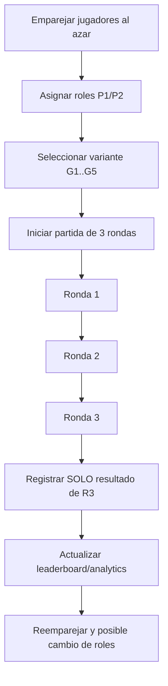
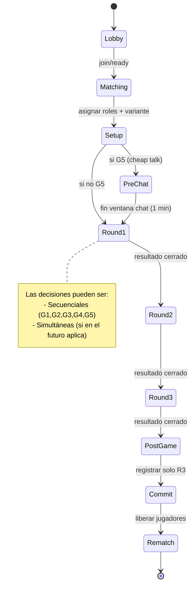
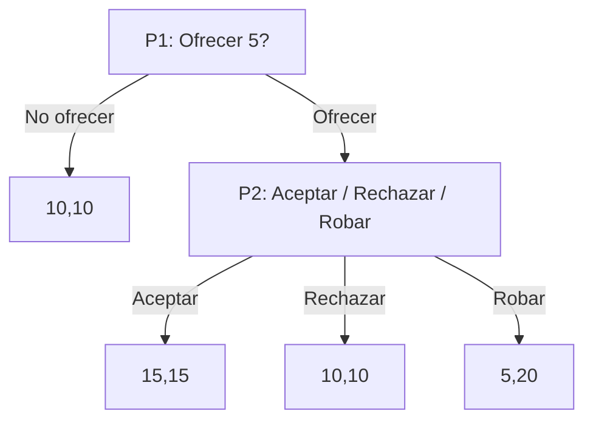
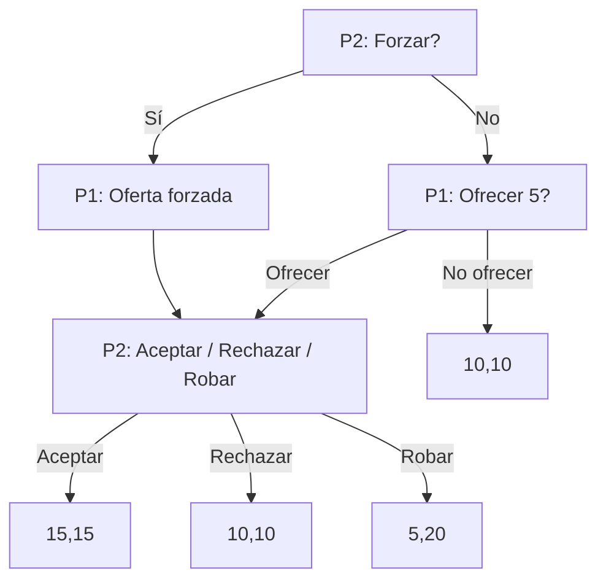
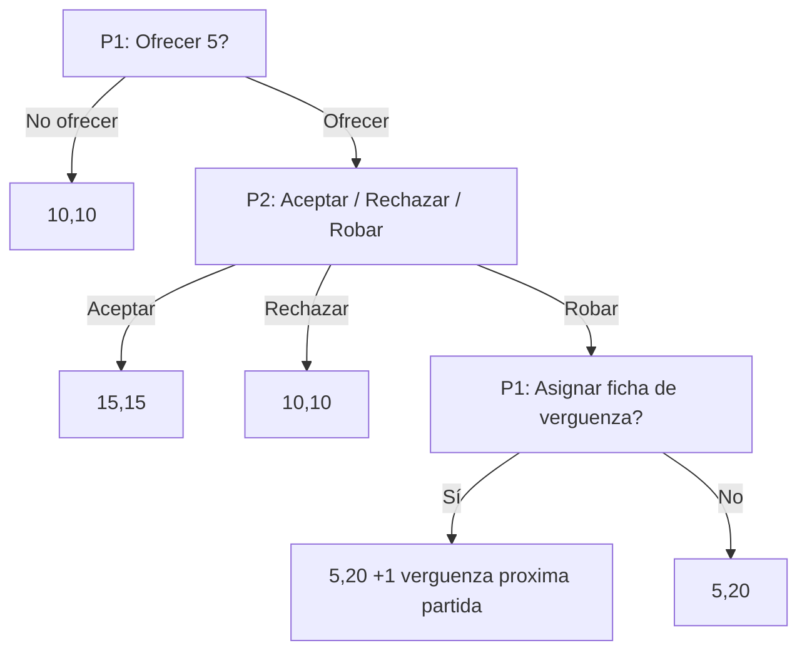
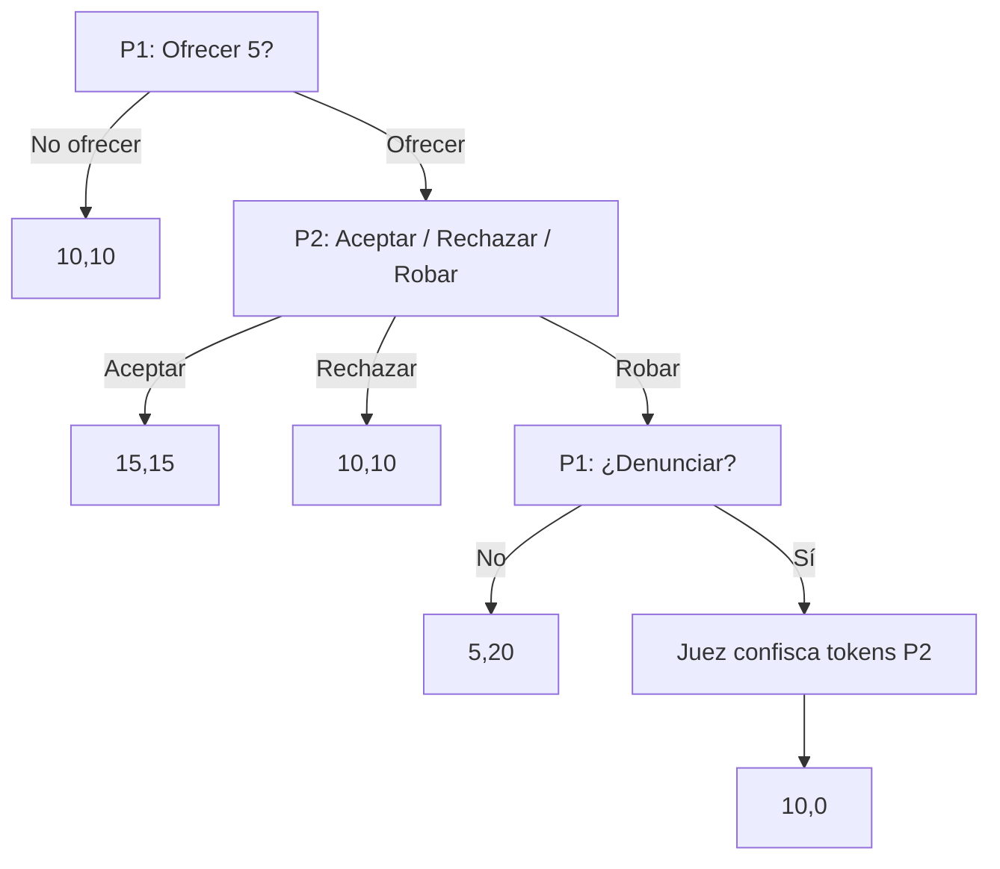
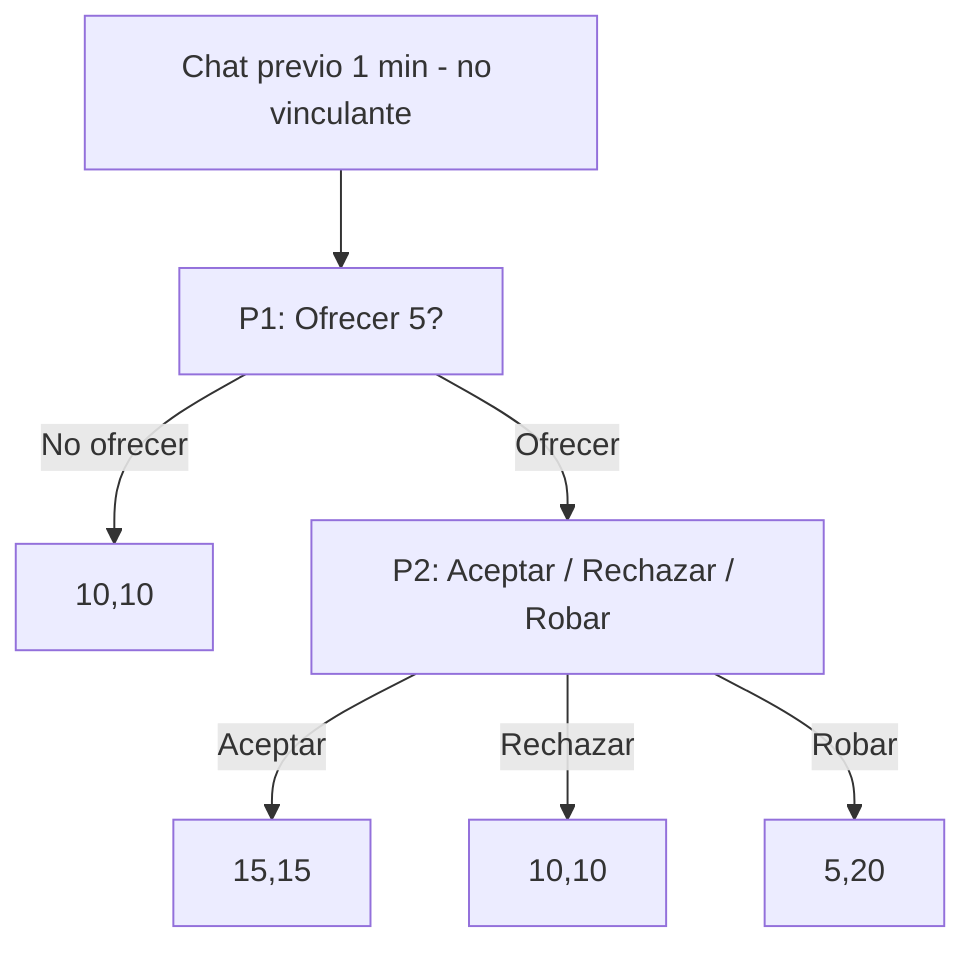
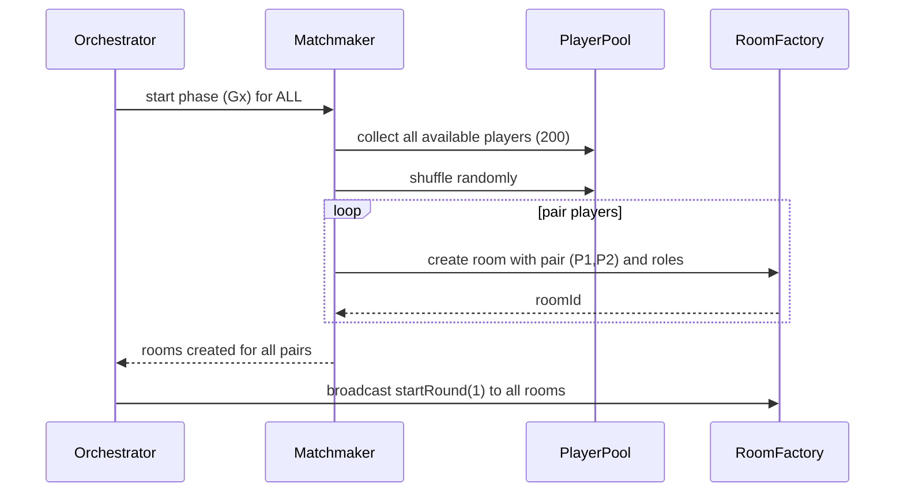
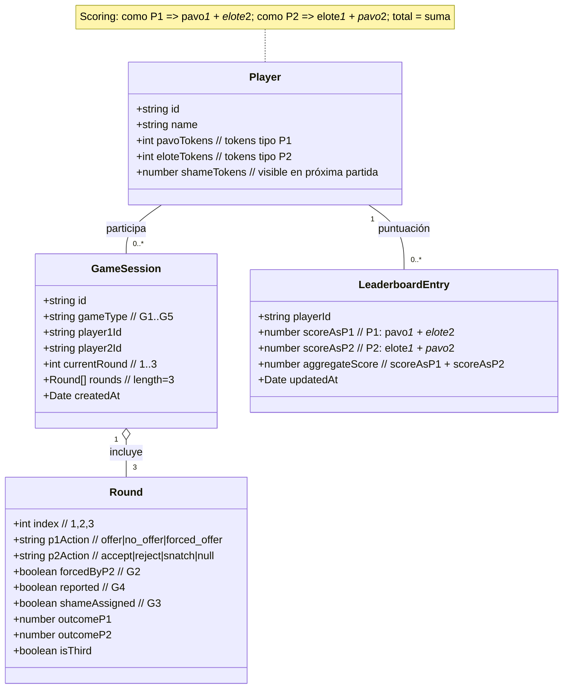

# SnatchGame – Diagramas Mermaid

Este índice reúne los diagramas claves para implementar el juego y verificar los flujos. Puedes abrir cada `.mmd` con la extensión oficial de Mermaid o verlos embebidos abajo.

## Visión general del ciclo



## Orquestación global (200 jugadores, G1->G5)

```mermaid
%% tournament-orchestration.mmd
flowchart TD
  Start[Init torneo] --> PhaseG1[Phase G1: iniciar]
  PhaseG1 --> MatchG1[Emparejar 200 jugadores al azar]
  MatchG1 --> RoomsG1[Crear rooms P1-P2 y asignar roles]
  RoomsG1 --> PlayG1[Jugar 3 rondas en paralelo]
  PlayG1 --> CommitG1[Commit solo resultado de ronda 3]
  CommitG1 --> WaitAllG1[Esperar que TODOS terminen]
  WaitAllG1 --> RematchG2[Reemparejar todos al azar]
  RematchG2 --> PhaseG2[Phase G2: iniciar]
  PhaseG2 --> MatchG2[Emparejar 200 jugadores al azar]
  MatchG2 --> RoomsG2[Crear rooms y roles]
  RoomsG2 --> PlayG2[Jugar 3 rondas en paralelo]
  PlayG2 --> CommitG2[Commit ronda 3]
  CommitG2 --> WaitAllG2[Esperar TODOS]
  WaitAllG2 --> RematchG3[Reemparejar]
  RematchG3 --> PhaseG3[Phase G3: iniciar]
  PhaseG3 --> MatchG3
  MatchG3 --> RoomsG3
  RoomsG3 --> PlayG3
  PlayG3 --> CommitG3
  CommitG3 --> WaitAllG3
  WaitAllG3 --> RematchG4
  RematchG4 --> PhaseG4[Phase G4: iniciar]
  PhaseG4 --> MatchG4
  MatchG4 --> RoomsG4
  RoomsG4 --> PlayG4
  PlayG4 --> CommitG4
  CommitG4 --> WaitAllG4
  WaitAllG4 --> RematchG5
  RematchG5 --> PhaseG5[Phase G5: iniciar]
  PhaseG5 --> MatchG5
  MatchG5 --> RoomsG5
  RoomsG5 --> PlayG5
  PlayG5 --> CommitG5
  CommitG5 --> End[Fin del torneo]
```



## Máquina de estados (Room/Partida)



## Secuencia por ronda (cliente-servidor)

```mermaid
%% game-sequence.mmd
sequenceDiagram
  participant P1 as Player 1
  participant P2 as Player 2
  participant S as Server/Room
  participant AJ as AutoJudge G4

  S->>P1: startRound(gameType, roundNo, role=P1)
  S->>P2: startRound(gameType, roundNo, role=P2)

  alt G2 (P2 decide forzar)
    P2->>S: decide(force or no_force)
    S-->>P1: forcedOffer = true/false
  else Otros juegos
    Note over P1,P2: Sin decision previa de P2
  end

  P1->>S: actionP1(offer or no_offer) - o forzado en G2
  S-->>P2: notifyP1Action(offer or no_offer)

  alt no_offer
    S-->>P1: outcome(10,10)
    S-->>P2: outcome(10,10)
  else offer
    P2->>S: actionP2(accept / reject / snatch)
    alt accept
      S-->>P1: outcome(15,15)
      S-->>P2: outcome(15,15)
    else reject
      S-->>P1: outcome(10,10)
      S-->>P2: outcome(10,10)
    else snatch
      opt G4 denuncia
        P1->>S: report: yes or no
        alt report=yes
          S->>AJ: aplicar sancion
          AJ-->>S: confiscar tokens P2
          S-->>P1: outcome(10,0)
          S-->>P2: outcome(10,0)
        else report=no
          S-->>P1: outcome(5,20)
          S-->>P2: outcome(5,20)
        end
      opt G3 repudio
        P1->>S: shameToken: assign yes or no
        S-->>P2: actualizar contador verguenza (proxima partida)
      end
    end
  end

  opt Round3 - persistir resultado R3
    S->>S: actualizar leaderboard y analytics
  end
  S-->>P1: endRound
  S-->>P2: endRound
```

## Variantes de juego

### G1 – Sin derechos de propiedad


### G2 – Regla contraproductiva (P2 puede forzar)


### G3 – Token de repudio (vergüenza)


### G4 – Derechos mínimos de propiedad (juez)


### G5 – Cheap talk (conversación previa)


## Emparejamiento en masa (fase Gx)



## Modelo de datos (mínimo)



---

Notas:
- Solo el resultado de la R3 se agrega al leaderboard/analytics.
- G2 introduce `forcedByP2`; G3, `shameAssigned` y contador visible en la siguiente partida; G4, `reported` y sanción del juez.
- El servidor es autoritativo; clientes no mutan estado.
