# SnatchGame – Diagramas Mermaid

Este índice reúne los diagramas claves para implementar el juego y verificar los flujos. Puedes abrir cada `.mmd` con la extensión oficial de Mermaid o verlos embebidos abajo.

## Visión general del ciclo

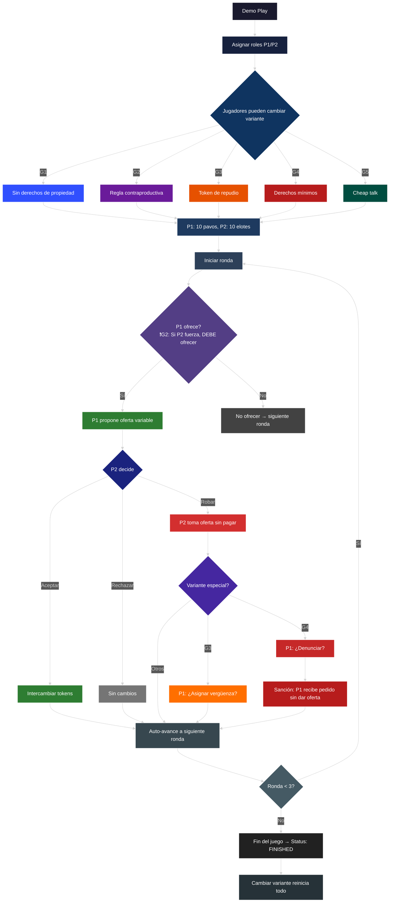

## Orquestación global (200 jugadores, G1->G5)

```mermaid
%% tournament-orchestration.mmd
flowchart TD
  Start[Init torneo] --> PhaseG1[Phase G1: iniciar]
  PhaseG1 --> MatchG1[Emparejar 200 jugadores al azar]
  MatchG1 --> RoomsG1[Crear rooms P1-P2 y asignar roles]
  RoomsG1 --> PlayG1[Jugar 3 rondas en paralelo]
  PlayG1 --> CommitG1[Commit solo resultado de ronda 3]
  CommitG1 --> WaitAllG1[Esperar que TODOS terminen]
  WaitAllG1 --> RematchG2[Reemparejar todos al azar]
  RematchG2 --> PhaseG2[Phase G2: iniciar]
  PhaseG2 --> MatchG2[Emparejar 200 jugadores al azar]
  MatchG2 --> RoomsG2[Crear rooms y roles]
  RoomsG2 --> PlayG2[Jugar 3 rondas en paralelo]
  PlayG2 --> CommitG2[Commit ronda 3]
  CommitG2 --> WaitAllG2[Esperar TODOS]
  WaitAllG2 --> RematchG3[Reemparejar]
  RematchG3 --> PhaseG3[Phase G3: iniciar]
  PhaseG3 --> MatchG3
  MatchG3 --> RoomsG3
  RoomsG3 --> PlayG3
  PlayG3 --> CommitG3
  CommitG3 --> WaitAllG3
  WaitAllG3 --> RematchG4
  RematchG4 --> PhaseG4[Phase G4: iniciar]
  PhaseG4 --> MatchG4
  MatchG4 --> RoomsG4
  RoomsG4 --> PlayG4
  PlayG4 --> CommitG4
  CommitG4 --> WaitAllG4
  WaitAllG4 --> RematchG5
  RematchG5 --> PhaseG5[Phase G5: iniciar]
  PhaseG5 --> MatchG5
  MatchG5 --> RoomsG5
  RoomsG5 --> PlayG5
  PlayG5 --> CommitG5
  CommitG5 --> End[Fin del torneo]
```

## Máquina de estados (Room/Partida)

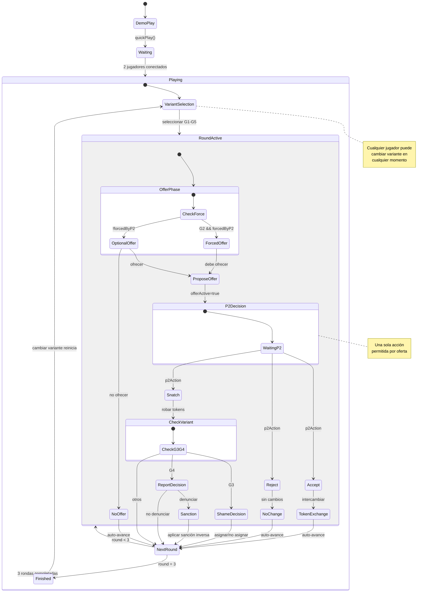

## Secuencia por ronda (cliente-servidor)

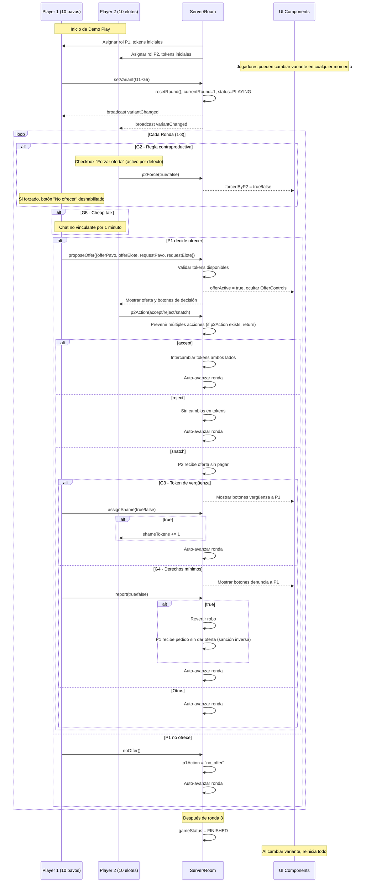

## Variantes de juego

### G1 – Sin derechos de propiedad (oferta variable)
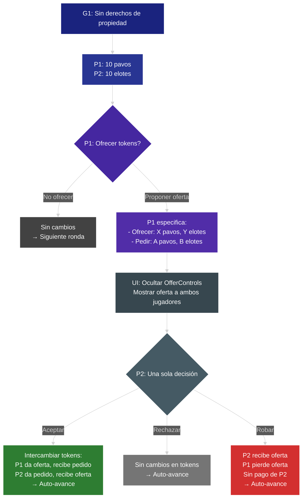

### G2 – Regla contraproductiva (P2 puede forzar) – oferta variable
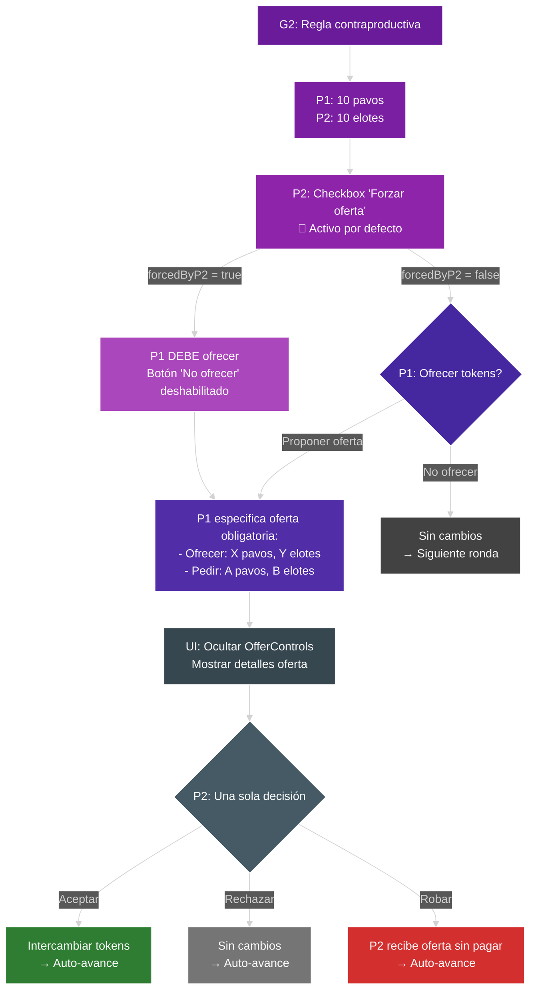

### G3 – Token de repudio (vergüenza) – oferta variable
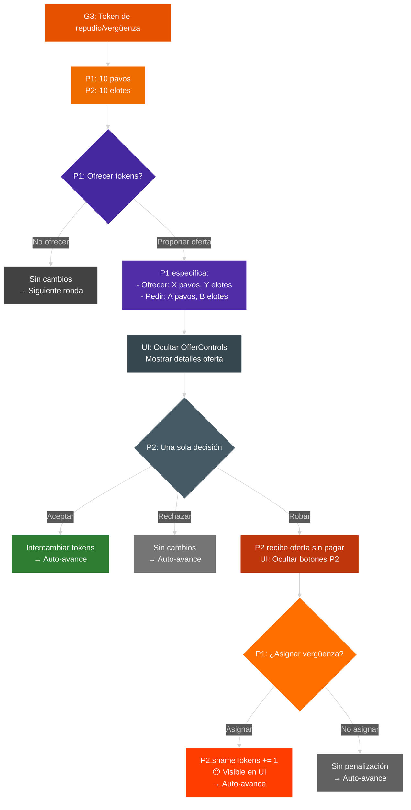

### G4 – Derechos mínimos de propiedad (juez) – oferta variable
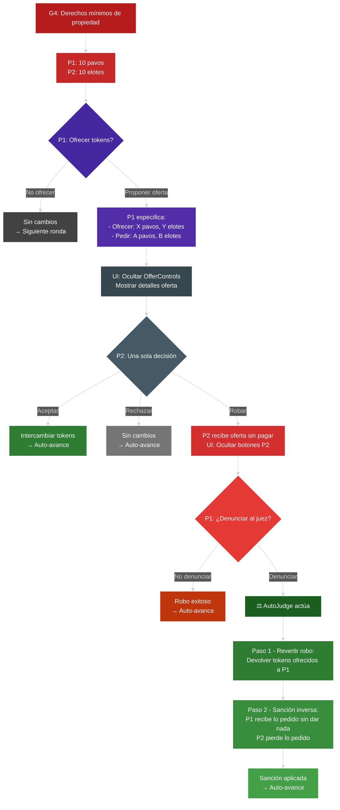

### G5 – Cheap talk (conversación previa) – oferta variable
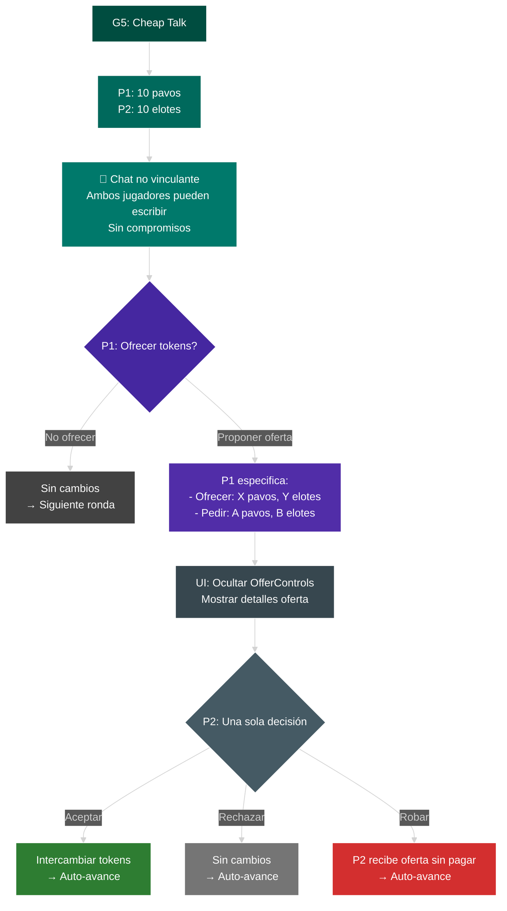

## Emparejamiento en masa (fase Gx)

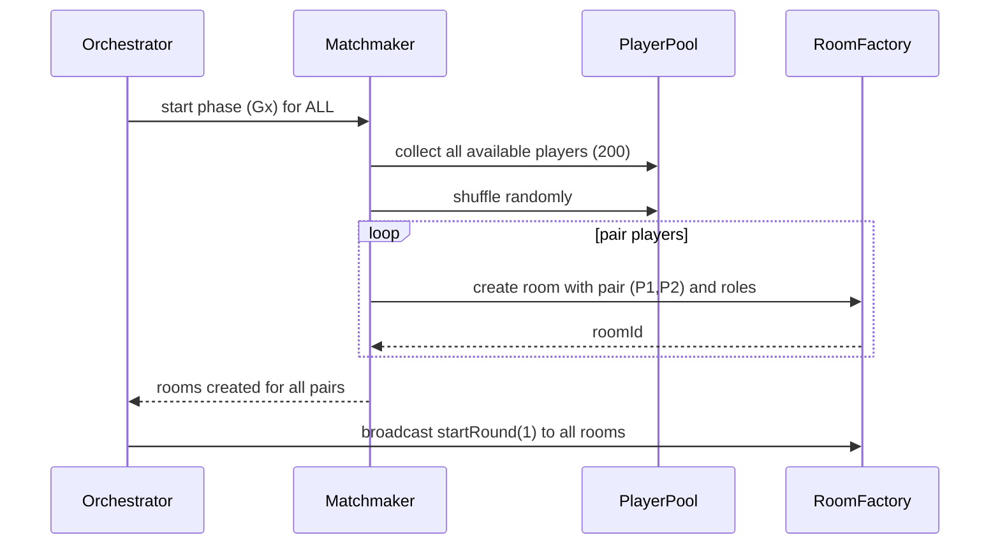

## Modelo de datos (mínimo)

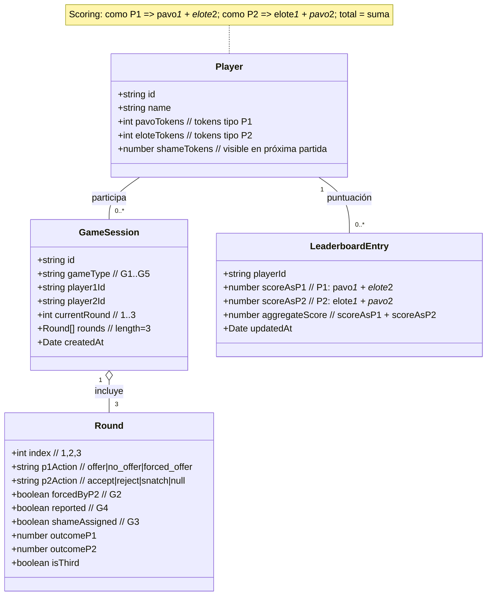

---

Notas:
- Solo el resultado de la R3 se agrega al leaderboard/analytics.
- G2 introduce `forcedByP2`; G3, `shameAssigned` y contador visible en la siguiente partida; G4, `reported` y sanción del juez.
- El servidor es autoritativo; clientes no mutan estado.
